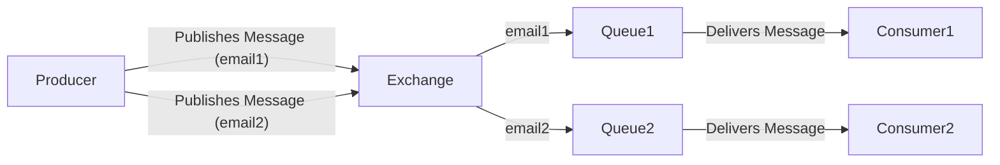

#One Exc# RabbitMQ-3

This project demonstrates a RabbitMQ setup with **one exchange and two queues** using Node.js and the `amqplib` library. Each queue receives a different message based on routing keys.

## Flowchart: One Exchange, Two Queues



## Files

- `producer.js`: Sends two different messages to two different queues via the exchange using different routing keys.
- `consumer1.js`: Listens for messages from `mailQueue1` (routing key: `email1`).
- `consumer2.js`: Listens for messages from `mailQueue2` (routing key: `email2`).

## How It Works

1. The producer connects to RabbitMQ, creates an exchange and two queues, binds them with different routing keys, and publishes two different messages.
2. Each consumer connects to RabbitMQ, creates the same exchange and its respective queue, binds them, and waits for messages to process.

## Usage

1. **Start RabbitMQ** on your local machine (default URL: `amqp://localhost:5672`).
2. **Install dependencies** (if not already):
   ```sh
   npm install amqplib
   ```
3. **Run the consumers** (in separate terminals):
   ```sh
   node consumer1.js
   node consumer2.js
   ```
4. **Run the producer** (in another terminal):
   ```sh
   node producer.js
   ```

You should see each consumer receive and log its respective message.

## Message Examples

**Queue 1 (`mailQueue1`):**
```json
{
  "text": "Hello, this is a message for Queue 1!"
}
```

**Queue 2 (`mailQueue2`):**
```json
{
  "text": "Hello, this is a message for Queue 2!"
}
```
